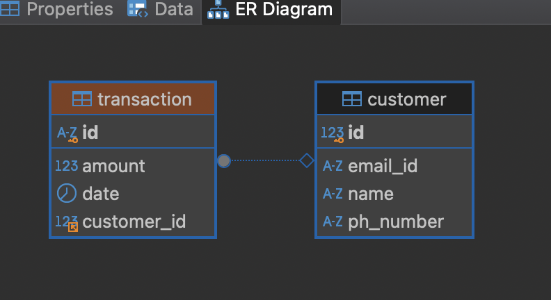
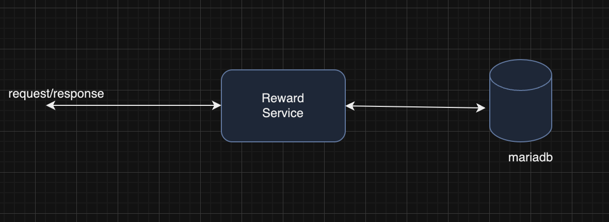

# Problem statement
This service provide a reward program to the customers, awarding points to the customers based on each transaction for a given time.

A customer receives 2 points for every dollar spent over $100 in each transaction, plus 1 point for every dollar spent between $50 and $100 in each transaction.
(e.g. a $120 purchase = 2*$20 + 1*$50 = 90 Points).

## Technology used:
+ Java 17
+ Springboot 3.3.3
+ Maven
+ MariaDB 11.5.2-MariaDB

### Test Proofs and Screens:
Please check the images folder.

## Entity Diagram:


## Data flow diagram:


## API Documentation:
Get Rewards:

   + URI: "api/1.1/reward/customer/[custId]?months=[months]"
   + Month default value 3, if not specified(optional).
   + Calculate and return rewards for a customer in below format.
   + Response Body:
  
    ```json
       {
		    "name": "Rakesh",
		    "year": 2024,
		    "totalPoints": 360,
		    "monthWisePoints": [{
		            "month": "MAY",
		            "points": 110
		        },
		        {
		            "month": "JULY",
		            "points": 180
		        },
		        {
		            "month": "APRIL",
		            "points": 70
		        }
		     ]
		   }
	```	   
Create transaction :

   + URI: "/api/1.1/transaction/create"
   + Method: POST
   + Request Body:
  
   ```json
   {
    "customerId": "1",
    "amount": 300
   }
 
 
